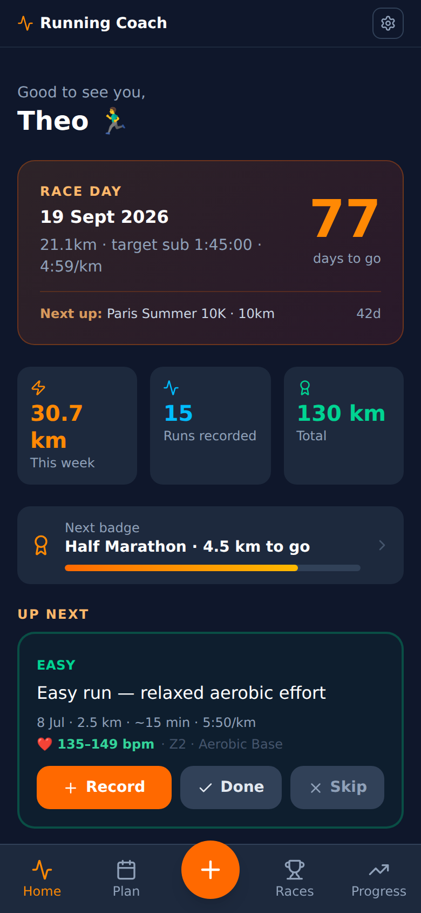
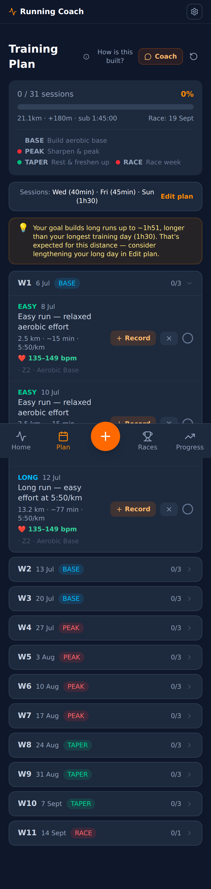
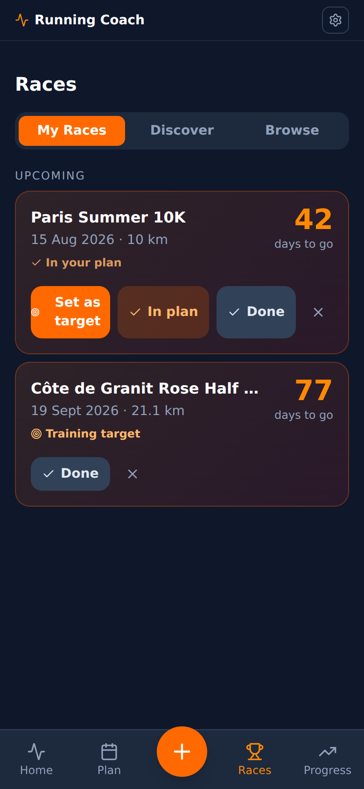
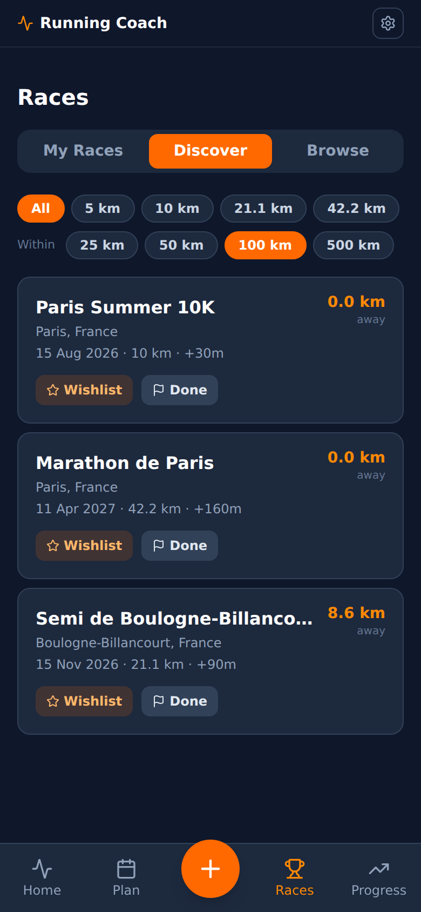
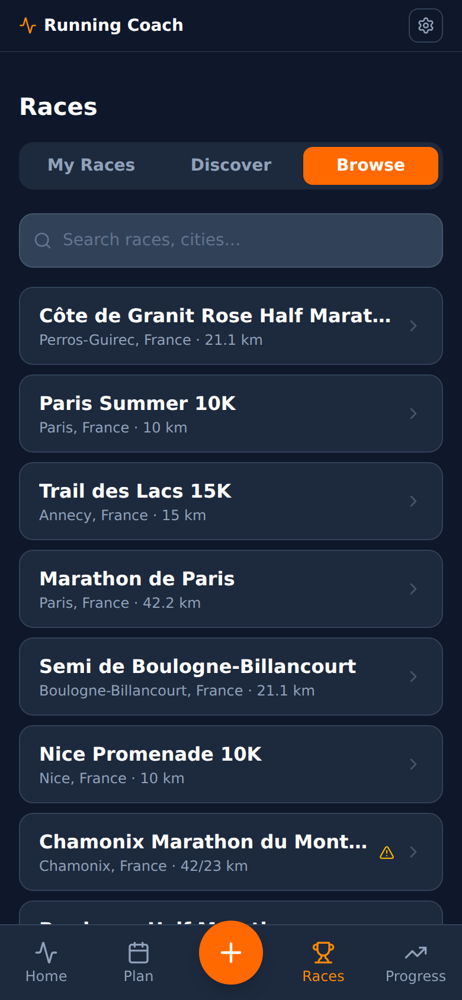
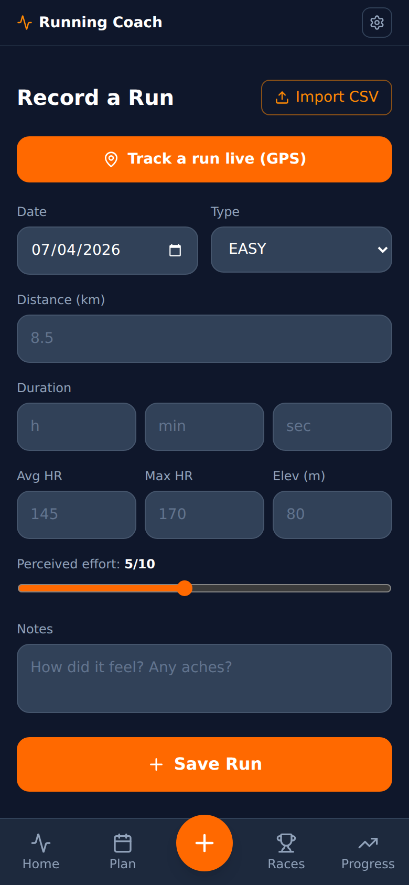
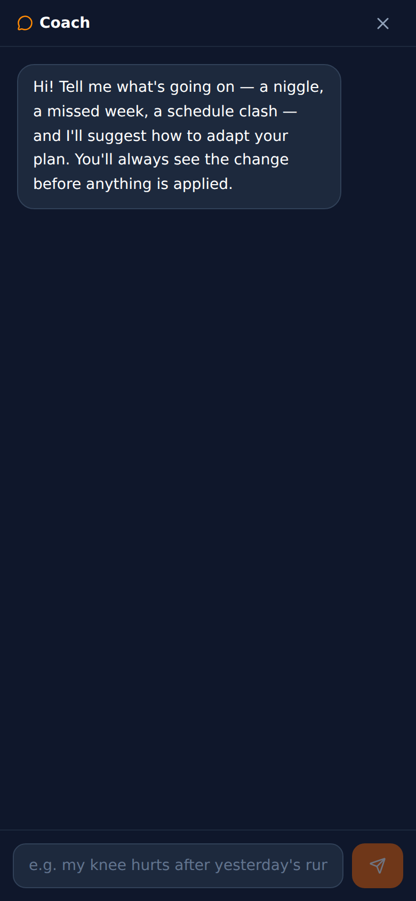
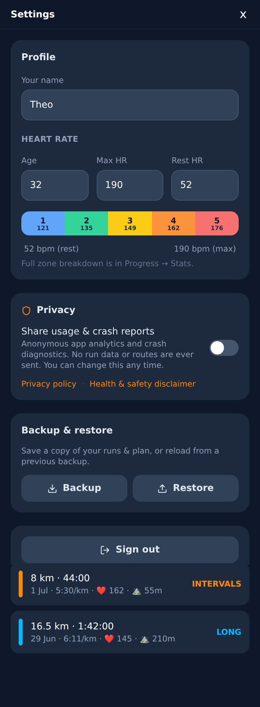
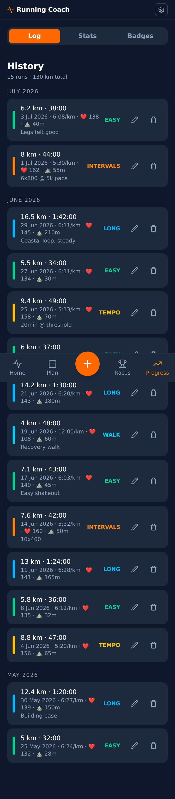

# Screenshots

Full-screen captures of the main app screens, kept for reference (design
reviews, docs, before/after comparisons). Mobile viewport (390×844, 2× DPR),
dark theme.

## How these were captured

The production site couldn't be reached from the review environment (network
policy), so the app was run locally (`npm run dev`) and seeded with a realistic
demo state — a half-marathon target ~11 weeks out, a full plan generated by the
real `buildPlan`, 15 varied runs (easy/tempo/intervals/long/walk with HR +
elevation), 3 race participations, and a small race catalogue for
Discover/Browse. No app source was changed; the seeding was throwaway
scaffolding kept out of the commit.

## Screens

### Home

### Plan (full scroll)

### Races — My Races

### Races — Discover (geolocation-sorted)

### Races — Browse

### Record a run

### Coach agent (Plan → Coach)

### Settings (full scroll)

### Progress (full scroll)

